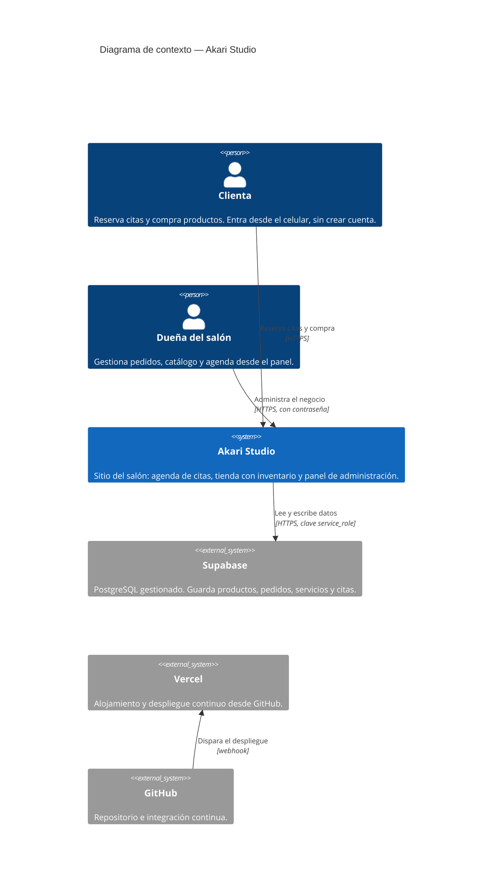
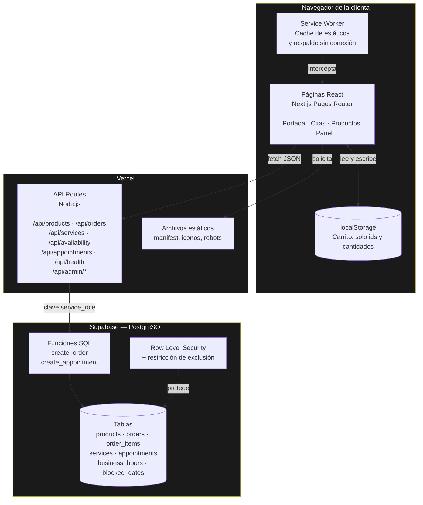
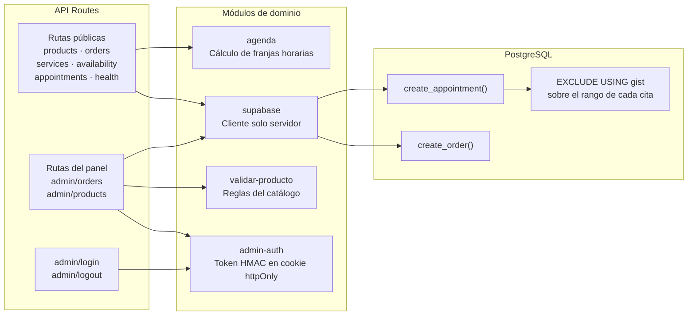
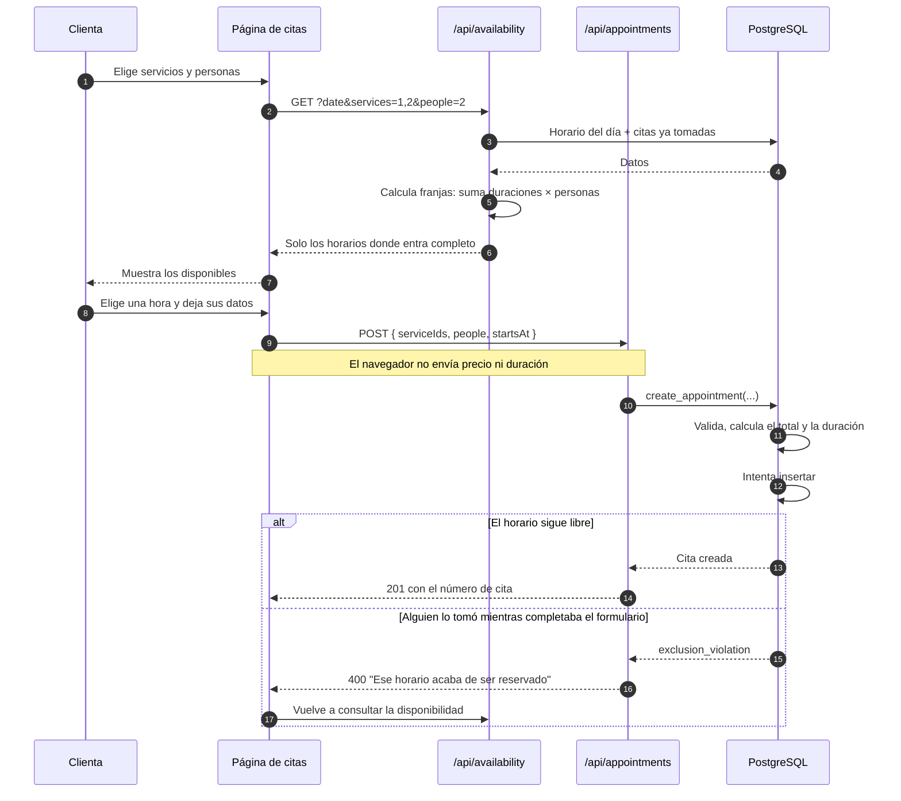
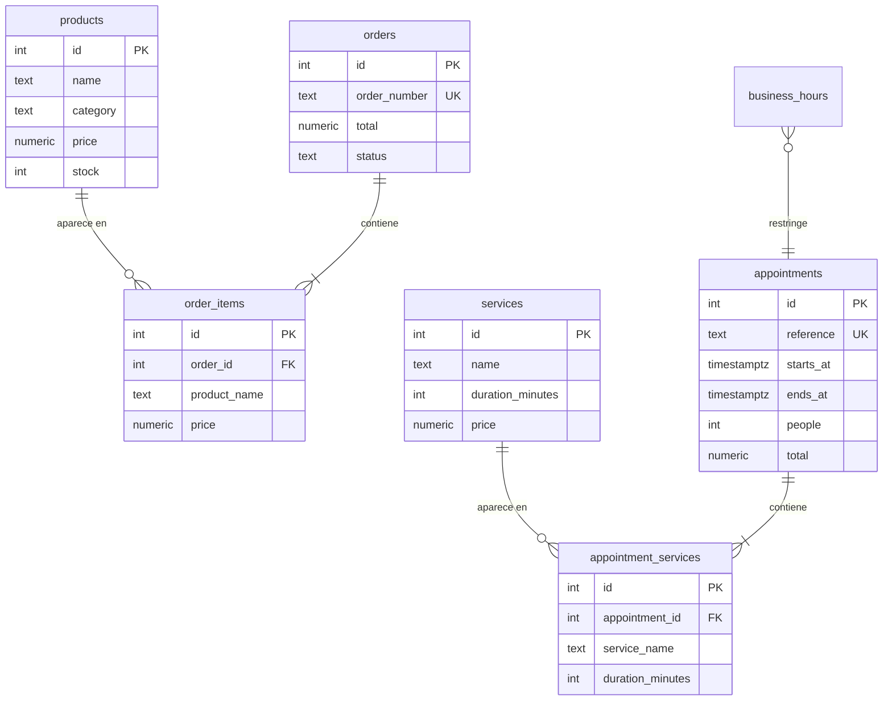
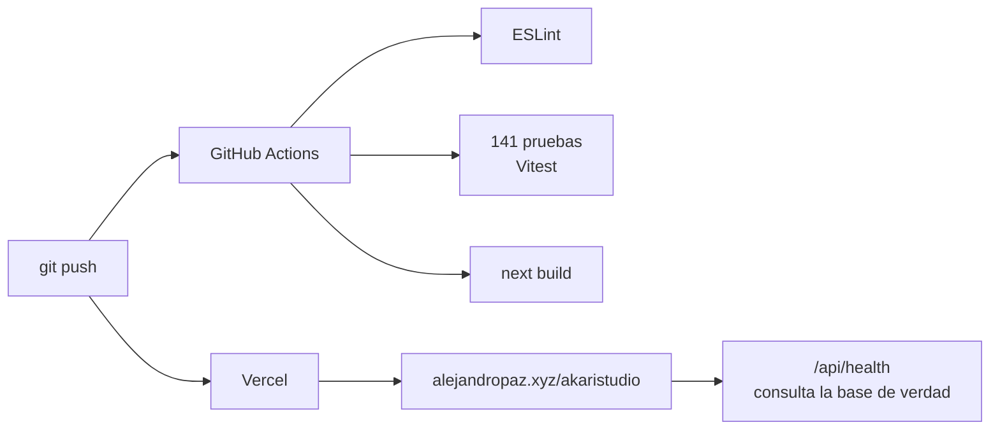

# Arquitectura — Akari Studio

Documento de arquitectura del sitio de Akari Studio: reserva de citas con disponibilidad en tiempo real, tienda en línea con inventario y panel de administración.

Código de verificación: `LEARN-CAP-76080609`

---

## 1. Contexto (C4 nivel 1)

Quiénes usan el sistema y con qué se conecta.

**Nota importante:** no hay ninguna flecha entre la clienta y Supabase. Es deliberado y es el eje de la [ADR-002](adr/ADR-002-acceso-a-supabase-solo-desde-el-servidor.md): el navegador nunca habla con la base de datos.

---

## 2. Contenedores (C4 nivel 2)

Las piezas desplegables y cómo se comunican.

| Contenedor | Tecnología | Responsabilidad |
|---|---|---|
| Páginas React | Next.js 14 + React 18 | Interfaz y estado de la pantalla. No decide nada con consecuencias. |
| Service Worker | API del navegador | Cachea estáticos y da respaldo sin conexión. Nunca cachea la API. |
| localStorage | API del navegador | Carrito entre visitas. Guarda solo ids y cantidades. |
| API Routes | Node.js sobre Vercel | Única vía hacia la base. Valida la forma de los datos y traduce errores. |
| Funciones SQL | PL/pgSQL | Reglas de negocio: precios, stock, solapamiento de citas. |
| PostgreSQL | Supabase | Persistencia e integridad. |

---

## 3. Componentes del backend (C4 nivel 3)

---

## 4. Flujo crítico: reservar una cita

El caso que mejor muestra dónde viven las decisiones.

---

## 5. Modelo de datos

`order_items` y `appointment_services` guardan **su propia copia** del nombre, el precio y la duración. No es redundancia por descuido: una venta ya cerrada debe conservar lo que se acordó ese día, aunque después cambie la tarifa o se elimine el producto del catálogo.

---

## 6. Decisiones registradas

| ADR | Decisión |
|---|---|
| [ADR-001](adr/ADR-001-reglas-de-negocio-en-la-base-de-datos.md) | Poner las reglas de integridad del negocio en la base de datos, no en la aplicación |
| [ADR-002](adr/ADR-002-acceso-a-supabase-solo-desde-el-servidor.md) | Acceder a Supabase únicamente desde el servidor, nunca desde el navegador |

---

## 7. Calidad y despliegue

Las pruebas corren sin base de datos: el cliente de Supabase se simula. Eso permite que el pipeline no necesite credenciales.
