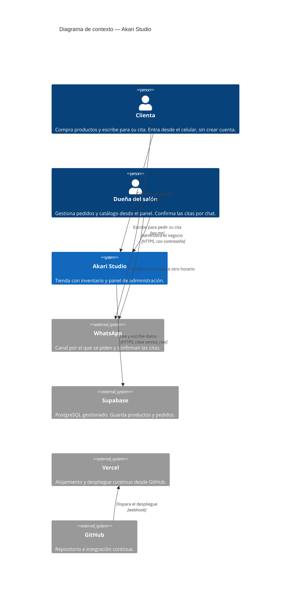
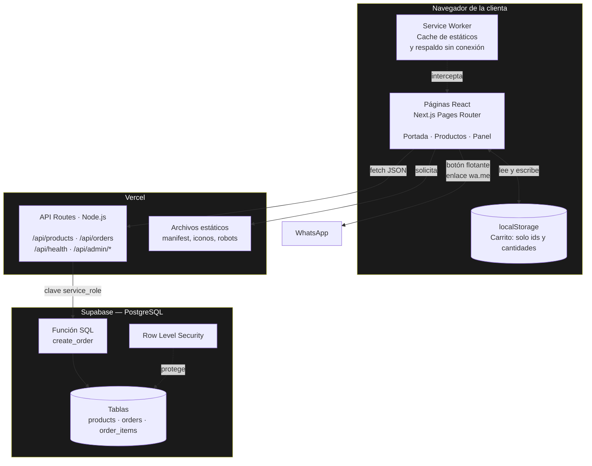
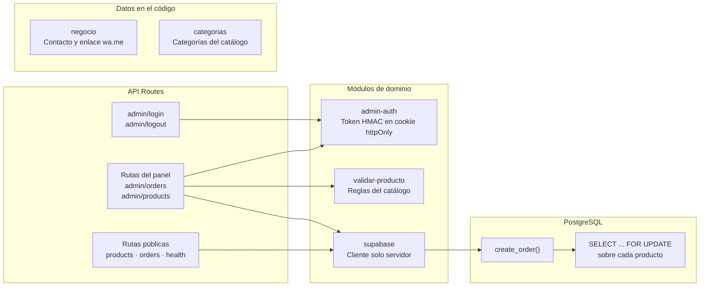
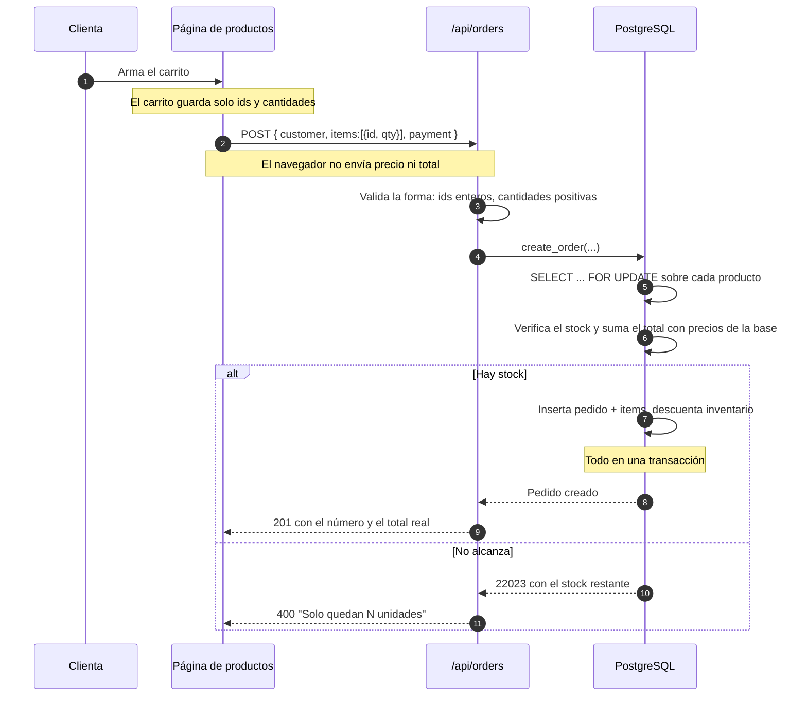
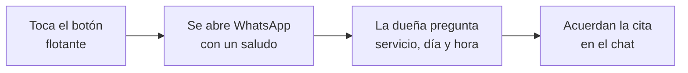
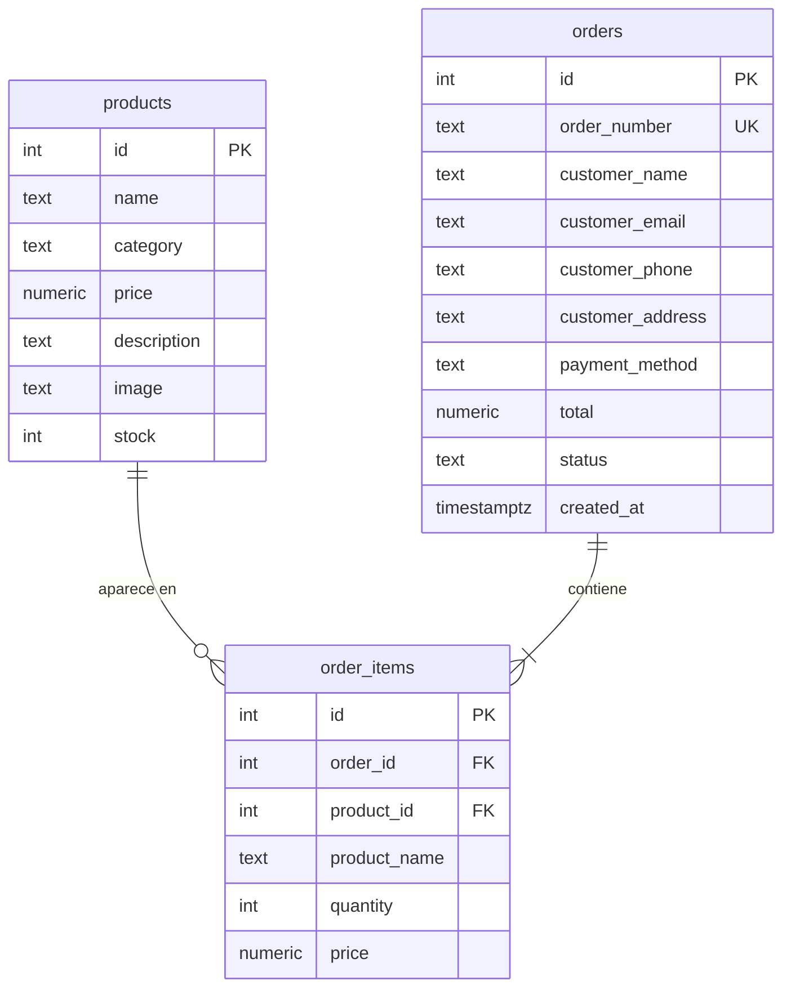
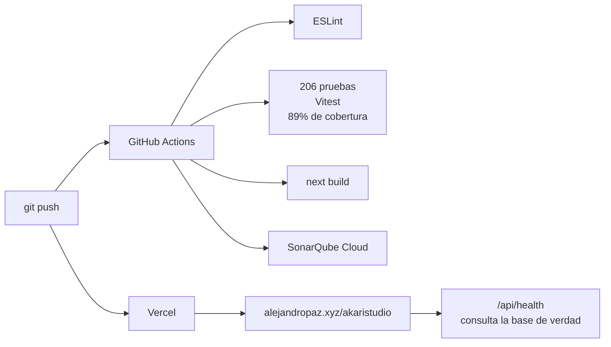

# Arquitectura — Akari Studio

Documento de arquitectura del sitio de Akari Studio: tienda en línea con inventario, contacto por WhatsApp para las citas, y panel de administración.

Código de verificación: `LEARN-CAP-76080609`

---

## 1. Contexto (C4 nivel 1)

Quiénes usan el sistema y con qué se conecta.

Dos cosas que vale señalar en este diagrama:

- **No hay ninguna flecha entre la clienta y Supabase.** Es deliberado y es el eje de la [ADR-002](adr/ADR-002-acceso-a-supabase-solo-desde-el-servidor.md): el navegador nunca habla con la base de datos.
- **Las citas salen del sistema.** El sitio solo abre la conversación con un botón; el servicio, el día y la hora los acuerda la dueña por chat. Es el resultado de la [ADR-003](adr/ADR-003-solicitud-de-citas-por-whatsapp.md).

---

## 2. Contenedores (C4 nivel 2)

Las piezas desplegables y cómo se comunican.

| Contenedor | Tecnología | Responsabilidad |
|---|---|---|
| Páginas React | Next.js 14 + React 18 | Interfaz y estado de la pantalla. No decide nada con consecuencias. |
| Service Worker | API del navegador | Cachea estáticos y da respaldo sin conexión. Nunca cachea la API. |
| localStorage | API del navegador | Carrito entre visitas. Guarda solo ids y cantidades. |
| API Routes | Node.js sobre Vercel | Única vía hacia la base. Valida la forma de los datos y traduce errores. |
| Función SQL | PL/pgSQL | Reglas de negocio: precios y stock. |
| PostgreSQL | Supabase | Persistencia e integridad. |

El pedido de cita **no tiene contenedor de ningún tipo**: es un enlace `wa.me` en un botón flotante. No hay página, ni ruta de API, ni tabla, ni estado.

---

## 3. Componentes del backend (C4 nivel 3)

---

## 4. Flujo crítico: hacer un pedido

El caso que mejor muestra dónde viven las decisiones.

## 4b. Flujo de un pedido de cita

Sin servidor, sin base de datos, sin página y sin estado. Es el flujo más simple del sistema porque, según la [ADR-003](adr/ADR-003-solicitud-de-citas-por-whatsapp.md), la dueña prefiere conducir esa conversación ella.

---

## 5. Modelo de datos

`order_items` guarda **su propia copia** del nombre y el precio. No es redundancia por descuido: una venta ya cerrada debe conservar lo que se cobró ese día, aunque después cambie la tarifa o se elimine el producto del catálogo. Por eso su clave foránea es `ON DELETE SET NULL` y no `CASCADE`.

---

## 6. Decisiones registradas

| ADR | Decisión |
|---|---|
| [ADR-001](adr/ADR-001-reglas-de-negocio-en-la-base-de-datos.md) | Poner las reglas de integridad del negocio en la base de datos, no en la aplicación |
| [ADR-002](adr/ADR-002-acceso-a-supabase-solo-desde-el-servidor.md) | Acceder a Supabase únicamente desde el servidor, nunca desde el navegador |
| [ADR-003](adr/ADR-003-solicitud-de-citas-por-whatsapp.md) | Reemplazar la reserva en línea por una solicitud enviada por WhatsApp |

La ADR-003 retiró una funcionalidad completa que ya estaba en producción, a pedido de la clienta. El sistema retirado —agenda con disponibilidad en tiempo real y restricción de exclusión sobre rangos de tiempo— queda en el historial de git.

---

## 7. Calidad y despliegue

Las pruebas corren sin base de datos: el cliente de Supabase se simula. Eso permite que el pipeline no necesite credenciales.
