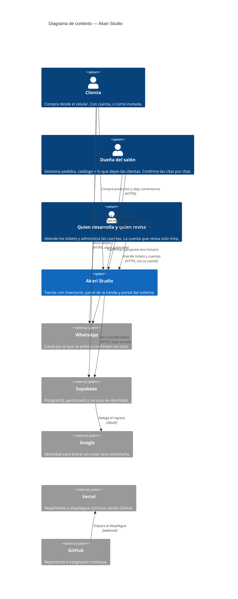
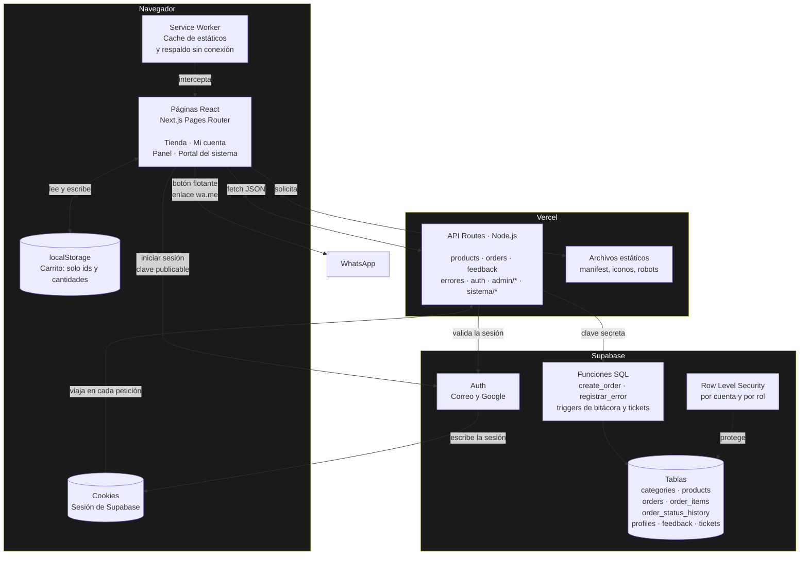
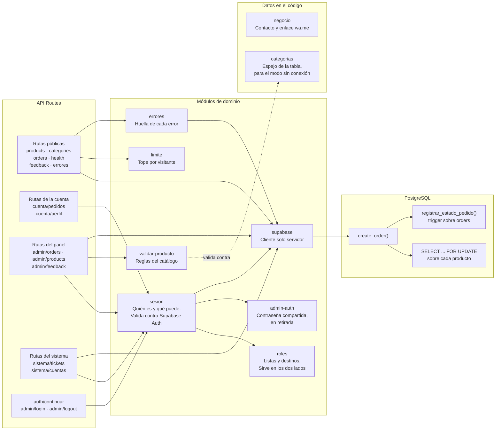
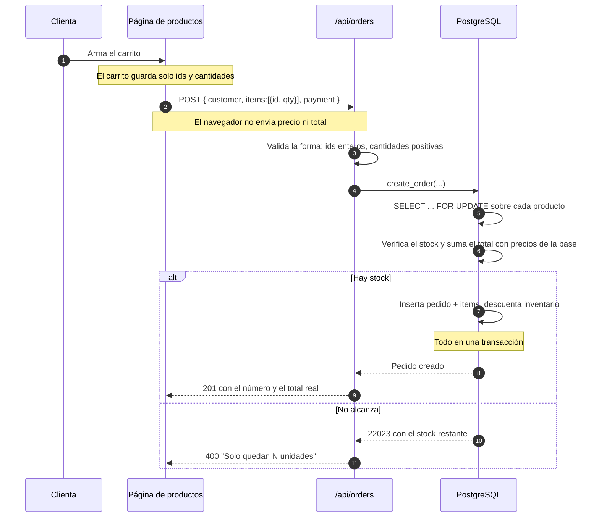
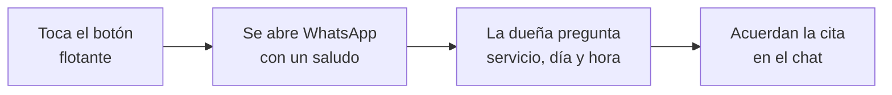
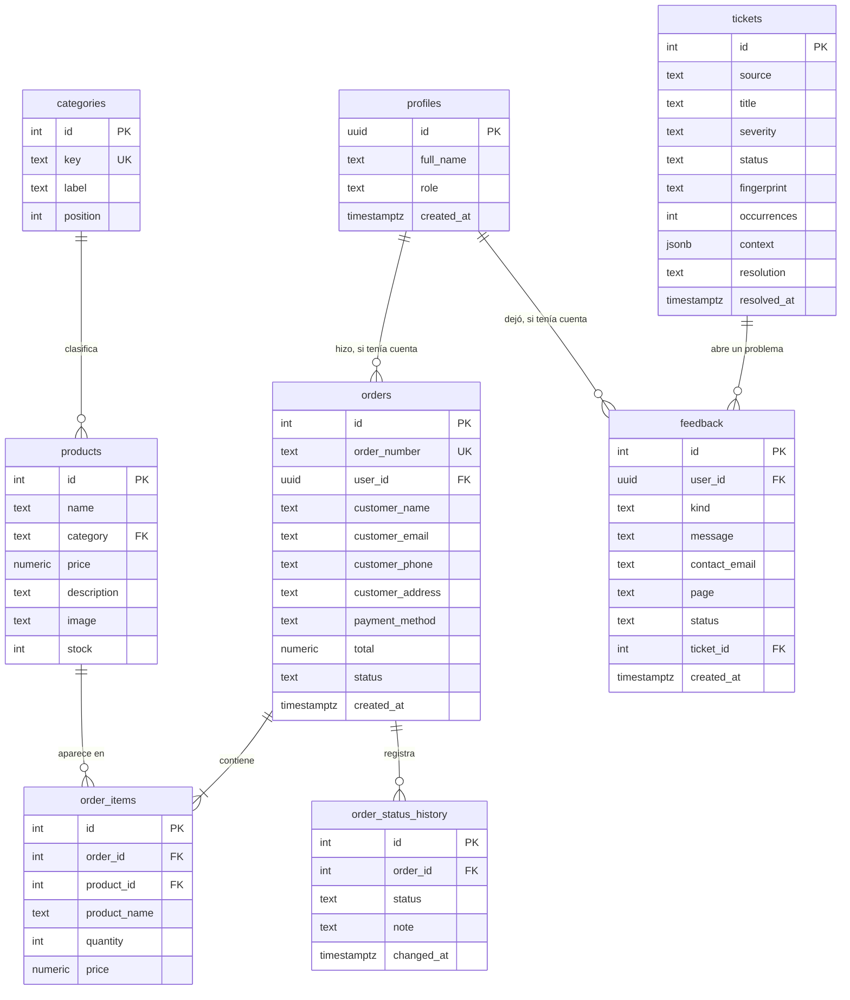
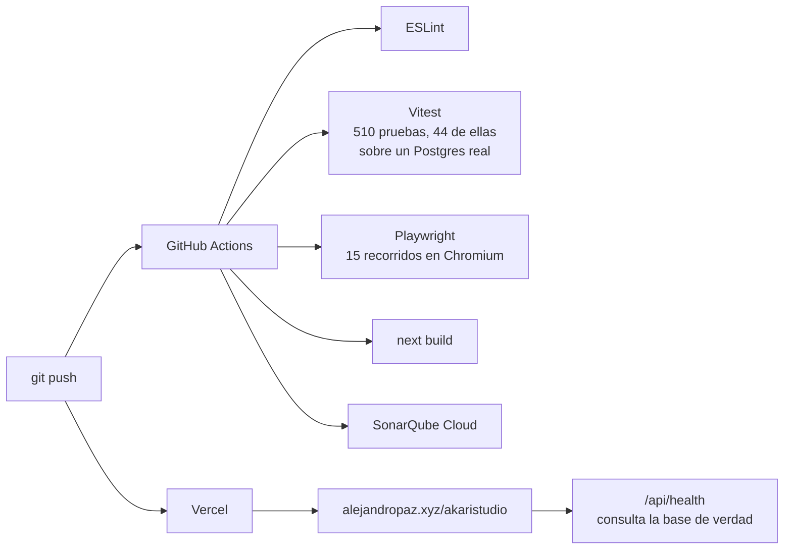

# Arquitectura — Akari Studio

Documento de arquitectura del sitio de Akari Studio: tienda en línea con inventario, contacto por WhatsApp para las citas, y panel de administración.

Código de verificación: `LEARN-CAP-76080609`

---

## 1. Contexto (C4 nivel 1)

Quiénes usan el sistema y con qué se conecta.

Tres cosas que vale señalar en este diagrama:

- **La única flecha entre la clienta y Supabase es la de iniciar sesión.** Ningún dato del negocio pasa por ahí: el catálogo, los pedidos y todo lo demás siguen entrando por el servidor. La [ADR-002](adr/ADR-002-acceso-a-supabase-solo-desde-el-servidor.md) decía que esa flecha no debía existir; la [ADR-004](adr/ADR-004-supabase-auth-solo-para-la-identidad.md) la abre solo para la identidad y explica qué se gana y qué se pierde con eso.
- **Entrar con cuenta es opcional.** Comprar como invitada sigue siendo la forma normal, y no hay ninguna pantalla que la obligue a registrarse para pagar.
- **Las citas salen del sistema.** El sitio solo abre la conversación con un botón; el servicio, el día y la hora los acuerda la dueña por chat. Es el resultado de la [ADR-003](adr/ADR-003-solicitud-de-citas-por-whatsapp.md).

---

## 2. Contenedores (C4 nivel 2)

Las piezas desplegables y cómo se comunican.

| Contenedor | Tecnología | Responsabilidad |
|---|---|---|
| Páginas React | Next.js 14 + React 18 | Interfaz y estado de la pantalla. No decide nada con consecuencias. |
| Service Worker | API del navegador | Cachea estáticos y da respaldo sin conexión. Nunca cachea la API. |
| localStorage | API del navegador | Carrito entre visitas. Guarda solo ids y cantidades. |
| Cookies de sesión | `@supabase/ssr` | La sesión, donde el servidor pueda leerla. Nunca en localStorage. |
| API Routes | Node.js sobre Vercel | Única vía hacia los datos. Valida la forma, decide por rol y traduce errores. |
| Supabase Auth | Supabase | Identidad: correo, Google y la verificación de cada sesión. |
| Funciones SQL | PL/pgSQL | Reglas de negocio: precios, stock, bitácora y agrupación de errores. |
| PostgreSQL | Supabase | Persistencia, integridad y, desde la ADR-004, filtrado por cuenta y rol. |

El pedido de cita **no tiene contenedor de ningún tipo**: es un enlace `wa.me` en un botón flotante. No hay página, ni ruta de API, ni tabla, ni estado.

---

## 3. Componentes del backend (C4 nivel 3)

---

## 4. Flujo crítico: hacer un pedido

El caso que mejor muestra dónde viven las decisiones.

## 4b. Flujo de un pedido de cita

Sin servidor, sin base de datos, sin página y sin estado. Es el flujo más simple del sistema porque, según la [ADR-003](adr/ADR-003-solicitud-de-citas-por-whatsapp.md), la dueña prefiere conducir esa conversación ella.

---

## 5. Modelo de datos

Cinco decisiones de modelado que no se leen solas en el diagrama:

**`order_items` guarda su propia copia del nombre y el precio.** No es redundancia por descuido: una venta ya cerrada debe conservar lo que se cobró ese día, aunque después cambie la tarifa o se elimine el producto del catálogo. Por eso su clave foránea es `ON DELETE SET NULL` y no `CASCADE`.

**`products.category` apunta a `categories.key` y no a `categories.id`.** Un id numérico sería lo ortodoxo, pero la clave de texto es la que ya viaja en la URL del filtro y la que devuelve la API, así que un id obligaría a resolver la traducción en cada consulta a cambio de nada. `key` es `UNIQUE`, que es todo lo que PostgreSQL pide para ser destino de una clave foránea.

**`order_status_history` la escribe un trigger, no la aplicación.** Si dependiera de que la ruta de API se acuerde de insertar la fila, bastaría con cambiar el estado desde el panel de Supabase para perder el registro. Es la misma lógica de la [ADR-001](adr/ADR-001-reglas-de-negocio-en-la-base-de-datos.md) aplicada a la auditoría.

**`orders.user_id` es opcional y `profiles` no es la tabla de usuarios.** Los pedidos de invitada —la forma normal de comprar acá— lo dejan en `NULL`, y borrar una cuenta no borra sus compras: la relación es `ON DELETE SET NULL`, porque la venta existió igual. Las cuentas viven en `auth.users`, que administra Supabase; `profiles` solo agrega lo que es del negocio, el nombre y el rol, y la crea un trigger cuando nace la cuenta.

**Un solo ticket abierto por huella, y eso lo garantiza un índice.** `tickets` tiene un índice único parcial sobre `fingerprint` que solo rige mientras el ticket está abierto o en progreso. Es lo que convierte cien ocurrencias del mismo error en un ticket con cien ocurrencias, incluso si llegan a la vez, y lo que hace que el mismo error después de resuelto abra uno nuevo: eso es una regresión y tiene que verse como tal.

---

## 6. Decisiones registradas

| ADR | Decisión |
|---|---|
| [ADR-001](adr/ADR-001-reglas-de-negocio-en-la-base-de-datos.md) | Poner las reglas de integridad del negocio en la base de datos, no en la aplicación |
| [ADR-002](adr/ADR-002-acceso-a-supabase-solo-desde-el-servidor.md) | Acceder a Supabase únicamente desde el servidor, nunca desde el navegador |
| [ADR-003](adr/ADR-003-solicitud-de-citas-por-whatsapp.md) | Reemplazar la reserva en línea por una solicitud enviada por WhatsApp |
| [ADR-004](adr/ADR-004-supabase-auth-solo-para-la-identidad.md) | Usar Supabase Auth para la identidad, y solo para eso. **Revisa la ADR-002** |
| [ADR-005](adr/ADR-005-roles-y-portales.md) | Cuatro roles, dos portales y una cuenta que solo mira |

La ADR-004 es la primera que revisa una decisión anterior sin borrarla: la ADR-002 sigue explicando por qué los datos no pasan por el navegador, y la ADR-004 abre la única excepción, la identidad, con sus costos anotados.

La ADR-003 retiró una funcionalidad completa que ya estaba en producción, a pedido de la clienta. El sistema retirado —agenda con disponibilidad en tiempo real y restricción de exclusión sobre rangos de tiempo— queda en el historial de git.

---

## 7. Calidad y despliegue

Ninguna prueba necesita credenciales, y cada capa lo resuelve distinto:

- Las **unitarias** simulan el cliente de Supabase.
- Las de **base de datos** levantan un PostgreSQL real en memoria con PGlite, aplican las migraciones y comprueban las políticas de RLS rol por rol. Son las que sostienen la [ADR-004](adr/ADR-004-supabase-auth-solo-para-la-identidad.md): desde que la clave publicable viaja en el navegador, una política mal escrita es una filtración.
- Las **E2E** usan la aplicación compilada e interceptan las rutas de API en el navegador, así que no crean pedidos de verdad.
